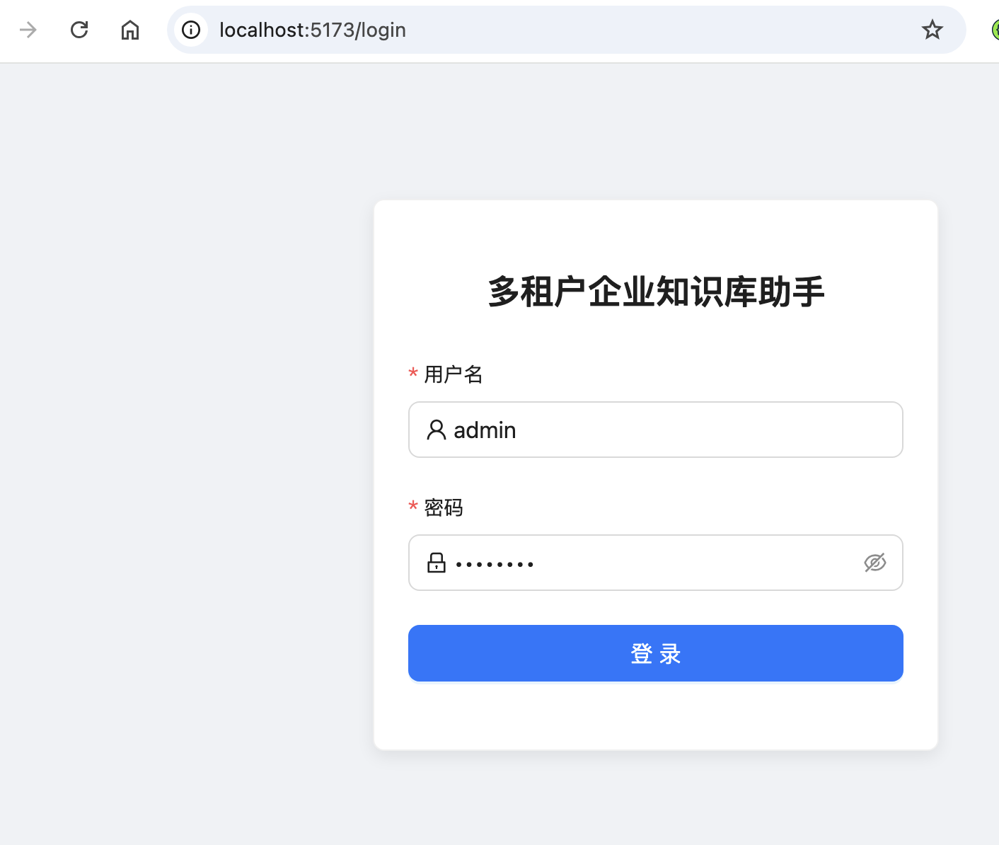
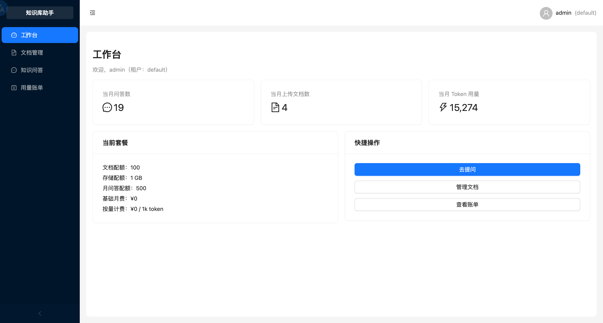
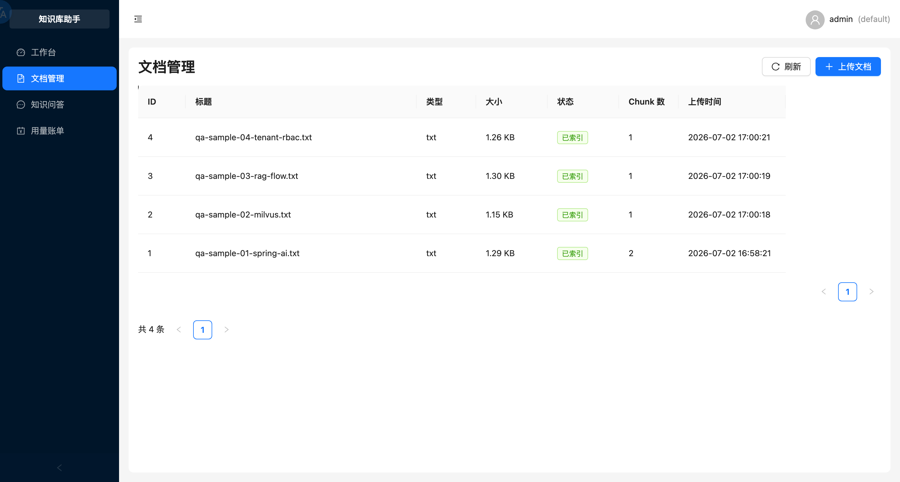
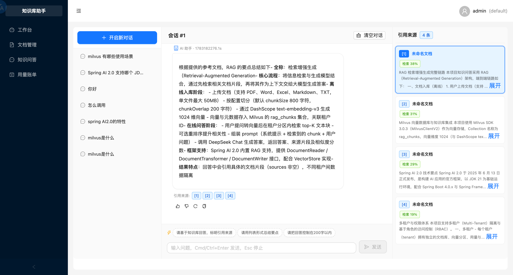
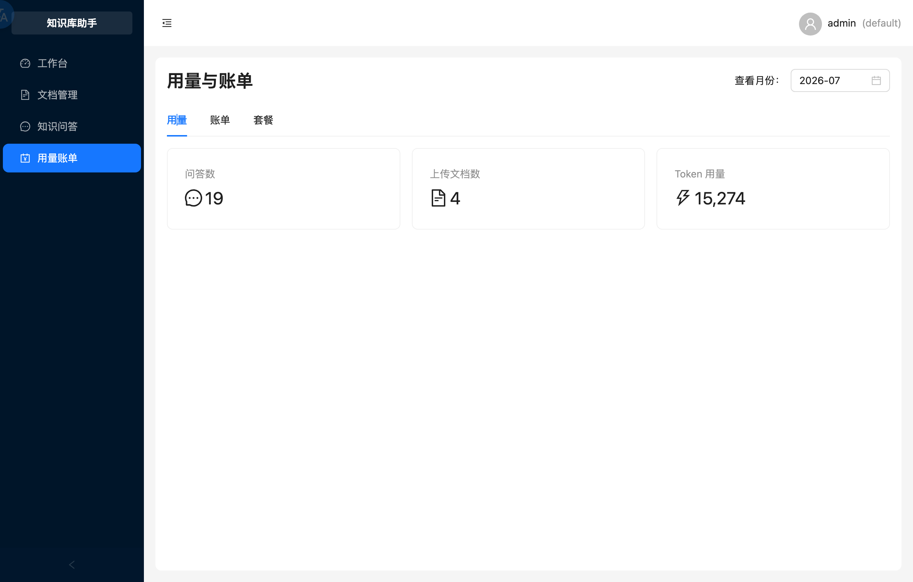
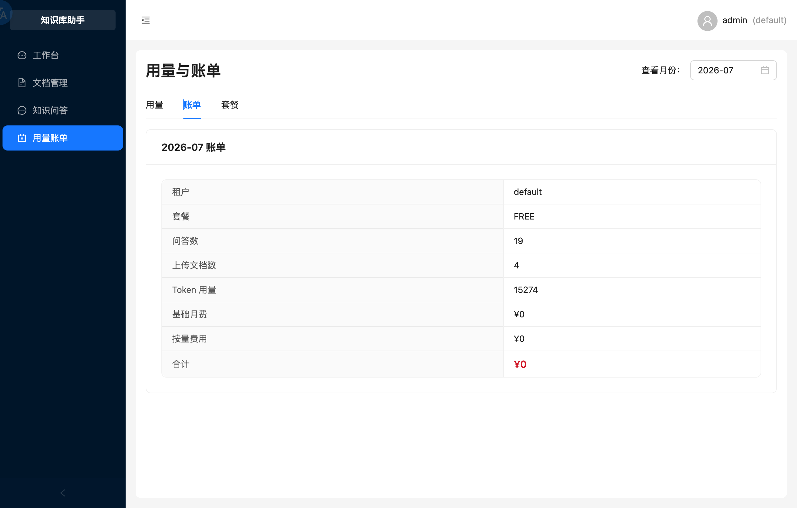

# 多租户企业知识库助手 · 前端

基于 **React 18 + TypeScript + Vite + Ant Design 5** 的 RAG 知识库 Web 前端，配套 Spring Boot 后端。

## 技术栈

| 组件 | 选型 |
|------|------|
| 框架 | React 18（函数组件 + Hooks） |
| 构建 | Vite 5 + TypeScript 5.6（strict 模式） |
| UI | Ant Design 5 + @ant-design/icons |
| 路由 | React Router 6（守卫 + 懒加载） |
| 状态 | Zustand 4（轻量、无模板代码） |
| HTTP | Axios 1.7（统一拦截器） |
| Markdown | react-markdown 9 + react-syntax-highlighter + remark-gfm |

## 核心特性

- **SSE 流式问答** — 自研 `useStreamingChat` Hook，逐字打字机输出 + 闪烁光标
- **三栏布局** — 会话列表(左) / 对话区(中) / 引用来源(右)，参考 Dify/FastGPT 设计
- **代码高亮** — react-syntax-highlighter（oneDark 主题）+ 一键复制 + 折叠
- **引用联动** — `[1]` 标签 hover 预览 + 点击右侧面板高亮定位
- **反馈闭环** — 👍/👎 点赞点踩 + 标签 + 评论 → 后端 API
- **多会话管理** — 侧栏列表切换/删除，URL 路由 `/chat/:conversationId`
- **权限控制** — RBAC（ADMIN/USER），控制文档上传/删除按钮显隐
- **键盘效率** — Cmd/Ctrl+Enter 发送、Esc 停止生成

## 快速启动

```bash
# 1. 安装依赖
npm install

# 2. 开发模式（需先启动后端）
npm run dev

# 3. 生产构建
npm run build
```

启动后访问 `http://localhost:5173`，Vite 自动将 `/api/**` 代理到后端 `localhost:8080`。

## 项目结构

```
src/
├── api/              # Axios 实例 + 业务接口（auth/chat/documents/billing/feedback）
├── hooks/            # 自定义 Hook（useAuth/useStreamingChat/useConversation/useFeedback）
├── stores/           # Zustand 状态（authStore/chatStore/conversationStore）
├── pages/Chat/       # 聊天页（三栏 + 流式）
│   └── components/   # 10+ 子组件（MessageBubble/StreamingMarkdown/InputBar...）
├── router/           # 路由表 + 守卫（ProtectedRoute/PublicRoute）
├── layout/           # BasicLayout/AuthLayout
├── types/            # TS 类型定义（与后端 DTO 对齐）
└── utils/            # 工具函数（storage/format）
```

## 页面一览

| 页面 | 功能 |
|------|------|
| 登录 | JWT 认证，自动跳转 |
| 工作台 | 统计卡 + 套餐信息 + 快捷入口 |
| 文档管理 | 上传/列表/下载/删除，处理状态轮询 |
| 知识问答 | 三栏流式问答 + 引用来源 + 会话管理 |
| 用量账单 | 月度用量 / 账单明细 / 套餐切换 |

## 效果图

<table>
  <tr>
    <td width="50%" align="center"></td>
    <td width="50%" align="center"></td>
  </tr>
  <tr>
    <td align="center"><b>登录页</b></td>
    <td align="center"><b>工作台</b></td>
  </tr>
  <tr>
    <td width="50%" align="center"></td>
    <td width="50%" align="center"></td>
  </tr>
  <tr>
    <td align="center"><b>文档管理</b></td>
    <td align="center"><b>知识问答（流式）</b></td>
  </tr>
  <tr>
    <td width="50%" align="center"></td>
    <td width="50%" align="center"></td>
  </tr>
  <tr>
    <td align="center"><b>用量概览</b></td>
    <td align="center"><b>账单明细</b></td>
  </tr>
</table>

## 环境要求

- Node.js ≥ 18（推荐 20+）
- 后端服务 [multi-tenant-knowledge](https://github.com/coder-change/multi-tenant-knowledge) 运行于 `localhost:5173`

---

## 联系


扫码关注公众号，获取更多技术分享与项目动态

## License

MIT
